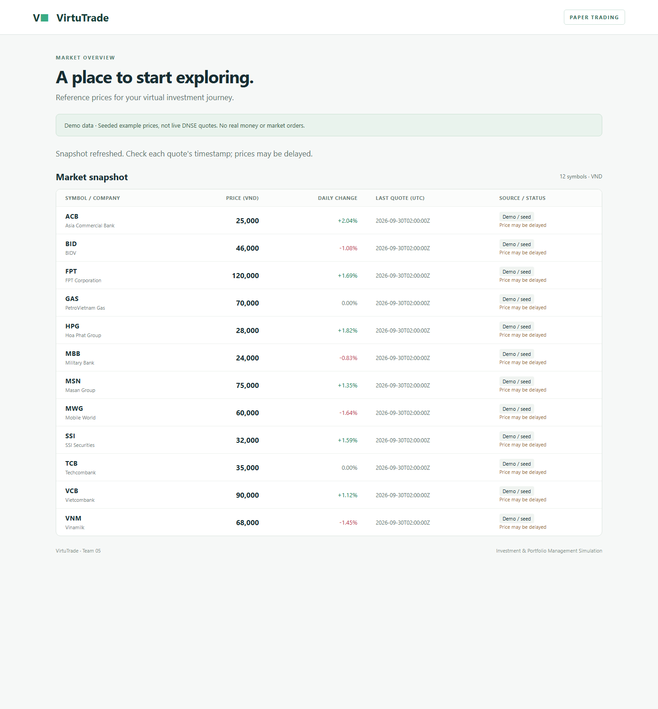

# Optional DNSE realtime market data

Owner: @bianh13, #59 (US14, P1, 5 points). This extends the M2 seed-backed
walking skeleton, separately from #49's API contracts. Login, virtual trades
and Admin services remain unimplemented.

## Run it

1. Complete [SETUP](SETUP.md) and check the seed-only `/market` page.
2. Obtain a DNSE OpenAPI key/secret with market-data access. Put them in the local
   ignored `.env` as `DNSE_API_KEY` and `DNSE_API_SECRET`. Never commit them, put
   them in an issue/chat or enter them in the browser. This quote-only worker
   needs no trading token, OTP or account password.
3. Install updated `requirements.txt`, stop the old app/worker and run
   `python app.py init-db` to upgrade an existing DB. IDs/data are preserved.
4. Start the web app and one feed worker in separate terminals with the same
   venv and `.env`:

   ```powershell
   # Terminal 1 (Windows)
   .\.venv\Scripts\python.exe app.py
   # Terminal 2 (Windows)
   .\.venv\Scripts\python.exe app.py stream
   ```

   On macOS/Linux, substitute `.venv/bin/python`. Ctrl+C stops each process.
   Run only one worker per database.
5. Open `http://127.0.0.1:5000/market`. It polls our JSON snapshot every three
   seconds. A row changes from Demo / seed to DNSE only after a valid tick.
   The market may be idle. Source labels are provenance, not socket-health checks.

| Variable | Value |
|----------|-------|
| DNSE_API_KEY | Required only for `stream`; backend only |
| DNSE_API_SECRET | Required only for `stream`; backend only |
| DNSE_SYMBOLS | Empty = seeded stocks; e.g. `HPG,FPT,VCB`. Existing stocks only, maximum 100; lowercase normalized. |
| DATABASE_PATH | Same DB for app and worker; default `instance/virtutrade.db` |

Environment variables override `.env`. The URL is fixed to
`wss://ws-openapi.dnse.com.vn/v1/stream?encoding=json` using certificate-verified
TLS. Keep workstation time synchronized for authentication.

## Protocol and data rules

The worker signs `api_key:timestamp:nonce` using HMAC-SHA256, waits for auth success,
then subscribes to `tick.G1.json` and `security_definition.G1.json`. It handles
WebSocket control pings and provider JSON ping/pong, reauthenticates/resubscribes
after network failure or a normal session close, and backs off from 1 to 60
seconds. Authentication/subscription rejection stops with a fixed safe message.
Raw payloads and credentials are never logged. SQLite write failure is fatal
rather than silently discarding valid prices.

Only configured G1 stock events (`T: t` or `sd`) are accepted. JSON decimals
convert to integer VND without float arithmetic. This adapter maps one G1 stock
price unit to 1,000 VND (`24.35` -> `24,350`), based on DNSE stock examples/board
convention; compare units in the first authenticated session. Do not apply the
mapping to derivatives. Reject nonpositive, nonfinite, oversized or fractional-VND
prices and timestamps more than five minutes ahead of the local clock.

UTC provider timestamps keep nine fractional digits. Atomic SQL comparisons
reject equal/older events, including nanosecond differences, across reconnects
and restarts. A first DNSE tick can replace a seed row. Store one quote per ticker;
there is no tick history. No incoming event creates an arbitrary instrument.

For live quotes, `price_quote.previous_close_vnd` is NULL. The public projection
uses DNSE `basicPrice` stored in `instrument.reference_price_vnd` only if its
`reference_at` and the quote share a Vietnam trading date (UTC+7). This is the
provider's reference, not necessarily the literal prior close after adjustments.
Reference events persist separately, whether received before or after ticks.
Demo references are never used for a live percentage change.

DNSE documents reference broadcasts around 08:00 and 20:00. Starting mid-session
can show prices with **Reference unavailable** until a matching reference arrives;
there is no REST bootstrap in this slice. Quotes older than 15 minutes show
**Price may be delayed**, including after hours. Stopping/disconnecting preserves
price/time. A successful database API response does not prove feed connectivity.

GET `/api/market/quotes` is a public read-only snapshot, not an arbitrary broker
proxy: 200 with `quotes: []` for an empty DB, or 503 with error code
`MARKET_UNAVAILABLE` when unavailable. Prices are integer VND, `change` is a
decimal string or NULL, and caching is disabled. The browser retains its last
snapshot with a visible warning if refresh fails.

## Verification

Run `python -m pytest -q` with the venv. Tests use temporary databases and a local
WebSocket server with fake keys to verify signatures, subscriptions, ping/pong,
reconnect with a fresh nonce, capped retries, malformed events, deduplication,
ordering, reference-date boundaries, persistence, legacy migration and HTTP output.
These tests do not establish live DNSE access.

Local Chrome checks also verified automatic polling, a simulated incoming quote
changing the displayed price/source, and retention of the last snapshot with a
warning on HTTP 503. The screenshot below shows the running seed-only page,
not a live-provider session; the required browser-address-bar evidence remains #53.



**Real-provider acceptance is pending:** add local keys, run during trading hours,
compare a subscribed ticker's unit/value/time with the DNSE board, then disconnect
and restart. Record date, tested commit, ticker and result in #59 without secrets.
If rejected, check key permissions and local clock; raw provider errors are not
printed. For a DB failure check DATABASE_PATH, permissions and `init-db`.

This slice does not bootstrap historical/last trades over REST, expose connection
health, guarantee exchange latency or implement order fills. The three-second
browser refresh interval is separate from the WebSocket stream.

Sources: [DNSE guide](https://developers.dnse.com.vn/docs/guide/market-data/connect/),
[official SDK protocol examples](https://github.com/dnse-tech/openapi-sdk/tree/main/python/dnse/websocket),
[DNSE board guide](https://banggia.dnse.com.vn/cach-doc-bang-gia),
[websockets client](https://websockets.readthedocs.io/en/15.0.1/reference/asyncio/client.html).
