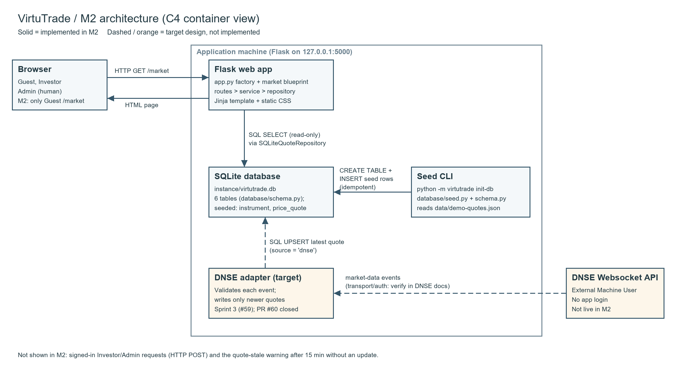
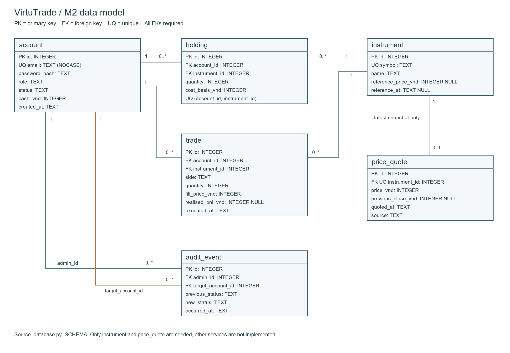
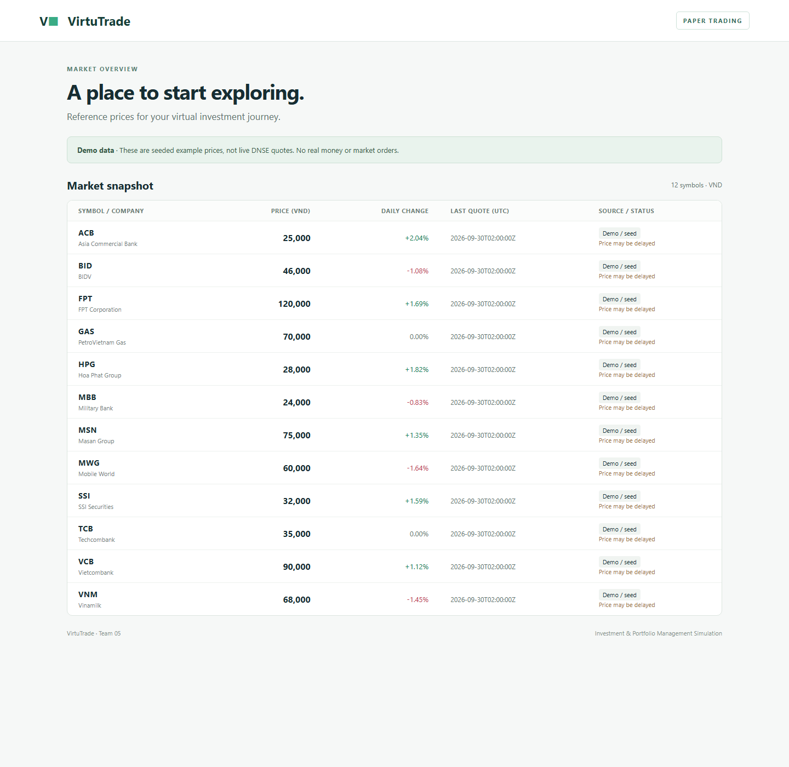

# Milestone 2 — VirtuTrade design

Team 05 · Topic A4 · Updated 4 October 2026.
PO / lead developer: @bianh13. Scrum Master: @nguyentue110.

**Working document, not final submission.** Architecture/ADRs (#47) and the
independent ERD review (#56) have merged. The PO's API contract (#49) and exact
cost-allocation decision (#48) are ready for peer review. Independent-machine
setup (#52), address-bar screenshot/final package (#53) and wrap-up (#54) remain
pending; optional live DNSE verification (#59) is deferred while required M2
deliverables are completed.

## 1. Architecture



Solid lines show what runs in M2; dashed lines show the target design.

**Actors.** Guest and Investor use the browser; Admin is a human who manages
account status; the DNSE Websocket API is an external Machine User (no login).

**M2 (implemented).** Browser → Flask → SQLite. `/market` reads 12 rows.
Prices are **demo/seed data, not live DNSE prices**.

**Target.** A DNSE adapter validates each event and writes only newer quotes
into price_quote. If the feed disconnects, the last quote keeps its original
timestamp and the page shows "Price may be delayed" after 15 minutes.

Current implementation uses Flask 3.1.3 and SQLite bundled with Python, within
the existing Python stack. Review references: [Flask installation](https://flask.palletsprojects.com/en/stable/installation/)
and [SQLite integration](https://flask.palletsprojects.com/en/stable/patterns/sqlite3/).
Vu recorded alternatives and change conditions in section 5 (merged PR #63).

**Module packaging.** The application factory registers the market Blueprint.
`src/virtutrade/market/` owns its routes, service, read-only SQL repository, template
and stylesheet; `src/virtutrade/database/` owns shared schema and seeding.
`src/virtutrade/app.py` defines the factory and `src/virtutrade/__main__.py`
provides the `python -m virtutrade` run/init-db commands. This implements the instructor's
request to locate page-specific changes in one folder. See the
[code structure and request flow](code-structure.md); external page URLs
are unchanged. SETUP now installs the checkout with `pip install -e .` and
starts it with `python -m virtutrade run`.

The factory selects a `SQLiteQuoteRepository`; the market service depends only
on the `QuoteReader` interface and immutable quote models. The controller handles
HTTP and rendering, the service calculates percentage/staleness rules, and the
repository executes SQL and translates database errors. SQL table constraints
remain in the shared schema. A market storage failure becomes a local 503;
this does not claim isolation from process-wide or shared-database failures.
Service tests use an in-memory reader without a Flask context or database.


### M3 UI-driven navigation refinement — 10 October 2026

The M2 runtime still redirects `/` to `/market`. The M3 UI walkthrough in
[ui.md](ui.md#4-what-changed-since-m2) exposes missing discoverable entry points.
Add designed page routes `/register`, `/login`, `/market/<symbol>`, `/trade`
and `/portfolio`; the existing account/order/portfolio JSON contracts remain
their backend boundaries. A guest can browse quotes, while Buy/Sell/Portfolio
guide them to sign in when required. Navigation must not substitute for server
authorization, and redirect targets must remain local.

Introduce a shared `src/virtutrade/templates/base.html` shell for visible
Market, Portfolio, Sign in/Register and Logout actions according to session state.
The factory configures shared templates; feature Blueprints own their page
templates and routes. The shell contains presentation only, not SQL, business
rules or secrets. This is an architecture/design change for M3, not a claim that
these screens or authentication work on the M2 baseline. Owners implement and
test these boundaries under #77, #81 and #85; #86 supplies the wireframes.

Sprint 3 Scrum Master is @longbk761-bot; the M2 role header above records history.
Simulation quote freshness for the clean-clone trading demo remains an explicit
decision under #75, without weakening stale/changed-quote checks.

## 2. Data model

Baseline owner: @bianh13, #48. Independent ERD review/testing: @nguyentue110,
#56 completed in PR #61 with 26 constraint tests and a keep-model decision.
See [independent review](erd-review.md); the PO response to its rounding and
future-storage findings is in [money rules](money-rules.md).
Source of truth: `src/virtutrade/database/schema.py::SCHEMA`. Tests import
the installed `virtutrade.database` package; the old root compatibility file
has been removed. The schema contents and constraints are unchanged.



[Editable SVG](diagrams/erd.svg) · [Diagram script](../scripts/diagram.py) · [Editing and export notes](diagrams/README.md).
All six tables exist after init-db; only instrument and price_quote are seeded.
Empty account/holding/trade/audit tables do not implement those features. Deferred
extensions are documented in [traceability](traceability.md).

Nullable fields: `trade.realised_pnl_vnd`, `price_quote.previous_close_vnd`,
`instrument.reference_price_vnd` and `instrument.reference_at`. An INTEGER PRIMARY KEY
is the SQLite row identifier. Timestamps are UTC ISO 8601 TEXT, validated by the
future service. Money is integer VND; services must validate integers because
SQLite type affinity alone is not an input validator.

| Table / purpose | Columns and types | Keys / constraints and rules |
|-----------------|-------------------|------------------------------|
| account: identity, role, state, virtual cash | id INTEGER; email TEXT COLLATE NOCASE; password_hash TEXT; role TEXT DEFAULT investor; status TEXT DEFAULT active; cash_vnd INTEGER DEFAULT 100000000; created_at TEXT | PK id; UNIQUE email (US01); role investor/admin and status active/disabled (BR9); cash >=0 (BR1 guard); default capital (BR5). Hashing, single grant and authorization need service code. |
| instrument: ticker identity | id INTEGER; symbol TEXT; name TEXT; reference_price_vnd INTEGER NULL; reference_at TEXT NULL | PK id; UNIQUE symbol (US03/BR10). |
| price_quote: latest snapshot per ticker | id INTEGER; instrument_id INTEGER; price_vnd INTEGER; previous_close_vnd INTEGER NULL; quoted_at TEXT; source TEXT | PK id; UNIQUE FK instrument_id → instrument.id; price >0; reference positive when present; source seed/dnse/simulation (BR10). One snapshot, no tick history; newer-event ordering is enforced by the DNSE repository. |
| holding: shares and remaining cost basis | id INTEGER; account_id INTEGER; instrument_id INTEGER; quantity INTEGER; cost_basis_vnd INTEGER | PK id; FKs account_id → account.id, instrument_id → instrument.id; UNIQUE(account_id, instrument_id); quantity >0, cost_basis_vnd >=0 (BR2/BR6 guards). Remove holding after full sale. |
| trade: executed fill | id INTEGER; account_id INTEGER; instrument_id INTEGER; side TEXT; quantity INTEGER; fill_price_vnd INTEGER; realised_pnl_vnd INTEGER NULL; executed_at TEXT | PK id; FKs account_id → account.id, instrument_id → instrument.id; side buy/sell; quantity/fill price >0 (BR2/BR3 guards). Realised P&L is set for sales; buys may use NULL. Rejected attempts/conditional metadata require later extension. |
| audit_event: account-status change | id INTEGER; admin_id INTEGER; target_account_id INTEGER; previous_status TEXT; new_status TEXT; occurred_at TEXT | PK id; both FKs → account.id; both statuses active/disabled (BR9). Future service checks admin role and writes status/audit atomically; FK alone cannot authorize. |

Multiplicities: instrument 1 → 0..1 price_quote; account 1 → 0..* holding;
instrument 1 → 0..* holding; account 1 → 0..* trade; instrument 1 → 0..* trade;
account 1 → 0..* audit_event twice (admin_id and target_account_id). Child FKs
are required. Every write connection must enable foreign keys, as init-db does.
No cascade delete is configured, preserving referenced parent rows.

Future buy/sell services must acquire a write transaction, re-read cash/quantity
and quote, validate BR1/BR2, and update cash, holding and trade atomically.
CHECK cannot enforce cross-table affordability or prevent overselling. Average
cost is cost basis / quantity using Decimal; display rounding must never feed
back into storage. The [cost-allocation decision](money-rules.md) specifies
whole-VND ROUND_HALF_UP of total cost times sold/held quantity, exact remainder
retention and full residual allocation on final sale. It also fixes one-time
capital-grant behavior and worked examples. This is a design for peer approval;
the skeleton performs no trades.

Seed contract: 12 instruments and 12 quote rows; four other tables empty.
Initialization adds missing demo rows without overwriting prices or duplicating
identities. Fixed seed timestamps/source remain unchanged. Future schema changes
require migrations; init-db is not a schema upgrade tool.

## 3. API design

Owner: @bianh13, #49. Contract completed for review on 3 October 2026.
The table covers all seven P0 stories (US01-US06 and US10), with an optional
P1 Admin endpoint. [Full API contract](api-contract.md) includes JSON examples,
authentication/authorization, validation, errors, transaction boundaries and
the external DNSE protocol boundary. [Traceability](traceability.md) maps each
story to its scenario, screen, endpoint, tables and implementation status.

Only GET `/` (302 redirect) and GET `/market` run on main. The quote JSON
endpoint and worker are in resumed PR #60; all account/trade/portfolio/Admin APIs are designed,
not implemented. M2 requires these contracts, not a complete trading engine.

| Method | Path | Access / story | Input | Success output | Error codes | Status |
|--------|------|----------------|-------|----------------|-------------|--------|
| POST | `/api/accounts` | G; US01/US02 | email, password | 201 account id/email, cash_vnd=100000000; session cookie; Location `/api/portfolio` | 409 EMAIL_IN_USE; 422 VALIDATION_ERROR | Designed |
| POST | `/api/sessions` | G; US01 | email, password | 200 account id/role; session cookie | 401 INVALID_CREDENTIALS; 429 LOGIN_LOCKED; 403 ACCOUNT_DISABLED | Designed |
| DELETE | `/api/sessions/current` | U/A; US01 support | CSRF header; no body | 204; cookie expired, server session revoked | 401 AUTH_REQUIRED; 403 CSRF_FAILED | Designed |
| GET | `/market` | G/U; US03 | none | 200 HTML with quotes, including empty state | 503 HTML unavailable page | Implemented on main |
| GET | `/api/market/quotes` | G/U; US03 | no parameters | 200 quotes array; price/reference/time/source/stale/change | 503 MARKET_UNAVAILABLE | Implemented in resumed #60; review pending |
| GET | `/api/market/quotes/{symbol}` | G/U; US03 | ticker path parameter | 200 one quote object; stale prices remain viewable | 404 TICKER_NOT_FOUND; 503 QUOTE_UNAVAILABLE | Designed |
| POST | `/api/orders/preview` | U; US04/US05/US10 | side=buy/sell, symbol, quantity | 200 estimate_vnd, available quantity/cash, shortfall, can_submit, warning and quote time/source; no writes | 422 INVALID_QUANTITY/VALIDATION_ERROR; 404 TICKER_NOT_FOUND; 409 QUOTE_STALE; 503 QUOTE_UNAVAILABLE | Designed |
| POST | `/api/orders/buy` | U; US04/US10 | symbol, quantity, expected_quote_at | 201 trade, cash and updated holding | 409 INSUFFICIENT_CASH/QUOTE_CHANGED/QUOTE_STALE; 422 INVALID_QUANTITY; 404 TICKER_NOT_FOUND; 503 QUOTE_UNAVAILABLE | Designed |
| POST | `/api/orders/sell` | U; US05 | symbol, quantity, expected_quote_at | 201 trade with realised_pnl_vnd, cash and remaining holding or null | 409 INSUFFICIENT_SHARES/QUOTE_CHANGED/QUOTE_STALE; 422 INVALID_QUANTITY; 404 TICKER_NOT_FOUND; 503 QUOTE_UNAVAILABLE | Designed |
| GET | `/api/portfolio` | U; US06/US10 | none; session owner only | 200 cash_vnd, holdings, total_value_vnd and valuation status | 401 AUTH_REQUIRED; 403 ACCOUNT_DISABLED | Designed |
| PATCH | `/api/admin/accounts/{id}/status` | A; US13 P1 | status=active/disabled | 200 id/status; audit entry for an actual transition | 403 ADMIN_REQUIRED; 404 ACCOUNT_NOT_FOUND; 409 SELF_DISABLE; 422 VALIDATION_ERROR | Designed, optional beyond P0 |

Shared private-route errors: 401 AUTH_REQUIRED, 403 ACCOUNT_DISABLED and,
for state-changing requests, 403 CSRF_FAILED. API errors contain code, message
and details. Buy/sell reject cash/share shortages, stale/changed quotes and
invalid quantities without partial writes. US10 preview does not replace
the backend's atomic BR1 validation. Refer to the full contract for exact
messages, example balances, initial grant and partial-sale allocation.

## 4. Walking skeleton

Owner: @bianh13, #50. **GET `/market`**, public/read-only, reads price_quote joined
with instrument: **12 rows** after clean initialization. Full commands: [SETUP](SETUP.md).
No credentials, external feed or separate DB server are needed.

The page lists ACB, BID, FPT, GAS, HPG, MBB, MSN, MWG, SSI, TCB, VCB and VNM,
with VND price, daily change, UTC time and Demo / seed badge. Quotes older than
15 minutes show a warning. Sample prices are illustrative, not live DNSE data.

Actual query in `src/virtutrade/market/repository.py::read_market`:

```sql
SELECT i.symbol, i.name, q.price_vnd, q.previous_close_vnd,
       q.quoted_at, q.source
FROM price_quote AS q
JOIN instrument AS i ON i.id = q.instrument_id
ORDER BY i.symbol
```

The route only queries SQLite; init-db alone reads `data/demo-quotes.json`.
Committed `.env.example` documents configuration; real `.env` and database files
are ignored. Money remains integer VND; percentage display uses Decimal,
two decimal places and ROUND_HALF_UP.

Local tests verify repeatable seed, DB changes surviving a fresh app instance,
empty/unavailable states, seed/stale labels and constraints. Long owns independent
verification and expanded regression in #51/#52.

Final screenshot must show the running page and browser address bar (#53).
An automated page capture is supporting UI evidence, not a substitute for the
required browser-address-bar screenshot.



This image is a Chrome headless capture of `http://127.0.0.1:5000/market` backed
by the initialized local SQLite database, not a mockup. Browser chrome is absent;
Vu supplies the final address-bar capture for the submission package.

## 5. Design decisions

Both decisions describe the M2 implementation and the target design. The
DNSE adapter in ADR-2 is target design only and is not implemented in M2.

### ADR-1: SQLite instead of PostgreSQL

**Options considered**

1. SQLite file (Python standard library).
2. PostgreSQL in Docker.
3. JSON/CSV files read at startup.

**Decision:** SQLite, in the file `instance/virtutrade.db`.

**Why**

- The instructor must clone and run the project on a machine we have never
  seen. SQLite needs no database server and no Docker, so SETUP.md stays
  short and `python -m virtutrade init-db` creates and seeds the database in one
  command.
- It still enforces the rules the product depends on at database level:
  UNIQUE email (US01), `cash_vnd >= 0` (BR1 guard), UNIQUE
  (account_id, instrument_id) so buys aggregate into one holding (BR6),
  role/status/source CHECKs (BR9, BR10) and foreign keys. Our independent ERD
  review checks these with 26 constraint tests.
- A JSON/CSV file cannot enforce these constraints or give atomic updates of
  cash, holding and trade (BR1, BR2), which is the main risk of this product
  (a wrong P&L).
- Our data is tiny: 12 instruments, 12 quotes, and a few hundred rows per
  user at most.

**Trade-offs we accept**

- SQLite allows one writer at a time.
- Foreign keys are off by default, so every write connection must run
  `PRAGMA foreign_keys = ON`, as `init_database` does.
- There is no schema migration tool; `init-db` does not upgrade schemas.

**What would change our mind**

- Testing shows write-lock errors (`database is locked`) when the DNSE
  adapter writes quotes while users place orders, and enabling WAL mode and a
  busy timeout does not fix it.
- The app must be deployed for many concurrent users, or run on more than one
  machine.
- Moving to PostgreSQL would then be a Sprint 4 task. The schema uses plain
  SQL types, so the tables would carry over.

### ADR-2: Server-rendered Flask app with a separate DNSE adapter process

**Options considered**

1. **Flask monolith + separate adapter process.** Flask renders HTML and
   serves the JSON endpoints used for actions (buy, sell, status change). A
   separate process runs the DNSE adapter and writes quotes to the same
   database.
2. **Adapter as a background thread inside the Flask process.**
3. **Single-page app (SPA) with a separate REST API backend.**

**Decision:** option 1.

**Why**

- The adapter holds a long-lived websocket connection and needs its own
  reconnect loop. If it crashes or disconnects, `/market` must keep working
  and show the last stored quote with its original timestamp and a
  "Price may be delayed" warning (US03, US14, BR10). A separate process
  isolates that failure from the web app.
- A thread inside Flask would be duplicated if the app ever runs with more
  than one worker, which would open several feeds and cause duplicate
  writes.
- Keeping the adapter separate means M2 needs no credentials and no feed:
  the instructor runs only the web app and the seeded database (SETUP.md
  stays unchanged).
- Option 3 adds Node and a build step, which the SETUP prerequisites exclude,
  and it gives the team two codebases to keep in sync when the real risk is
  correctness of the money calculations, not UI richness.
- The browser never talks to DNSE. Only the adapter holds provider
  credentials, so no secret reaches the browser.
- The future adapter's writes will use validated functions in the market
  repository, so the "newer events only" rule (BR10) lives in one place.
  The current M2 repository only reads; shared initialization lives in
  `src/virtutrade/database/`.

**Trade-offs we accept**

- The web app and the adapter are two processes to start, and both open the
  same SQLite file (see ADR-1).
- Prices only refresh when the page is reloaded; the browser does not receive
  pushed updates.

**What would change our mind**

- Users need prices to update on screen without reloading: add
  Server-Sent Events from Flask to the browser (the adapter and database
  stay as they are).
- Starting two processes proves too error-prone for the team or the
  instructor: run the adapter as a thread, accepting the single-worker
  limit.
- The team grows or the UI becomes complex enough that a separate front end
  pays off: move to option 3.

## 6. What changed since M1

Owner: @bianh13, #46. Recorded 30 September from instructor feedback and repo
inspection, not invented Sprint 2 Review outcomes.

| Change | Before | Revision / reason |
|--------|--------|-------------------|
| Align scenarios/stories | S1 promised social opinions; S2 indicators, quarterly data and what-if without matching stories | Narrow S1/S2 to supported trading/portfolio steps; preserve interview insights and explicitly defer unsupported needs; add later-priority scenarios. |
| Budget warning priority | US10 was P2 though S1 needed it before confirmation | US10 becomes P0; US04 independently enforces cash limits on the server. |
| Admin role | No management scenario/story | S5/US13/BR9 specify account enable/disable and audit with explicit 403/no-mutation checks; schema now, service later. |
| Machine User | Generic provider associated directly with price viewing | DNSE Websocket API is external Machine User in S6/US14/BR10; backend adapter validates and stores latest quotes; no human persona/login invented. |
| Honest implementation status | Landing route marked Done while app.py was empty | Trace every story with implementation status; only US03 snapshot subset is locally verified. Sprint 1 closures are specification history. |
| Review route | Authenticated-only market implied live feed | Public read-only demo snapshot lets instructor verify browser/backend/DB without credentials. Trading/private data still require future authentication. |

Deferred findings stay in the research record. Closed Sprint 1 issues are not
reopened or counted again. New issues remain open until DoD, review and merge;
remaining evidence requirements must also be met.


### Sprint 3 DNSE implementation update — 10 October 2026

The separate process `python -m virtutrade stream` owns DNSE market authentication,
subscription and reconnect. The browser polls our read-only quote API; it never
contacts DNSE or receives secrets. The provider is still a Machine User. No broker
trading endpoint or token is used. Existing business layers remain separate.

`database/migrations.py` adds nullable provider reference metadata and migrates
price_quote without changing primary keys. The infrastructure table
`feature_migration(name TEXT PRIMARY KEY)` records `dnse-reference-v1`; it is not
a new business entity and does not consume auth's reserved user_version=2.
Migration and seed run in one explicit transaction; DDL failure rolls back.
Use a copied/backup database for upgrades as documented in SETUP and DNSE.md.
Daily change is unavailable until reference/tick share a Vietnam date; the schema
and ERD now show those nullable fields. Existing M2 fixed seed fixtures stay intact.

Live verification reached authenticated/subscribed state but received no events
in its bounded observation window. Price-unit comparison remains pending and
#59 stays open; local WebSocket/regression tests are not proof of live accuracy.


### M3 partial buy/simulation implementation — #76

The order Blueprint adds `/trade`, preview and buy JSON plus simulation refresh.
Routes handle HTTP; services enforce rules; one repository unit of work commits
cash, holding and trade atomically with in-transaction session/quote validation.
See [the auth/ownership handoff](order-implementation.md). No real auth adapter is
installed yet; missing integration fails closed. Auth/sell/portfolio remain with
their assigned owners and US04/US10 remain partly works.

The price_quote source CHECK now includes `simulation`; the feature ledger adds
`simulation-source-v1` without altering the auth schema version. `init-demo`
exclusively creates a new DB and explicitly generated quotes; it refuses to reset
an existing DB. A manual refresh checks auth, mode, sources and clock advancement
before writing, preserves financial rows and never changes seed fixtures/DNSE
timestamps. The source labels and separate DB boundary are part of the UI design.
