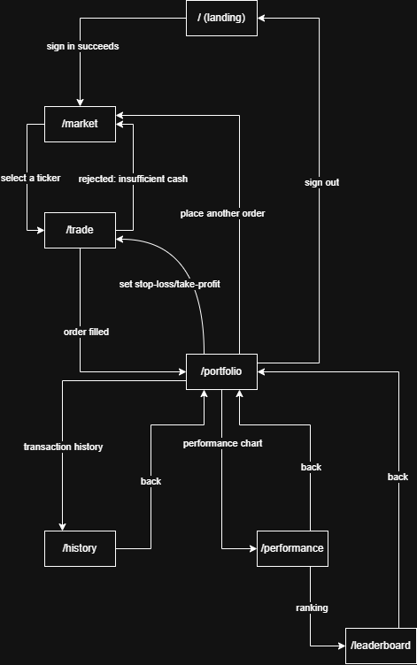

# Requirements - Investment & Portfolio Management Simulation

Milestone 1 · Sprint 1 deliverable. Six sections, in this order. A requirement
only counts if it can be checked: every user story below has at least one
acceptance criterion with a concrete number or an exact expected value.

> **Milestone 1 / Sprint 1 specification.** This document records the scope
> agreed from the two completed interviews and the Sprint 1 backlog.

---

## 1. Product vision

For beginners who need a safe way to learn stock trading and investors who
already manage several positions, the Investment & Portfolio Management
Simulation provides a realistic paper-trading portfolio with accurate cost
basis, P&L, transaction history, risk alerts and benchmark comparison, so users
can test decisions with market-referenced prices without risking real money or
manually rebuilding their portfolio in a spreadsheet.

---

## 2. Personas

#### 2.1 Persona
**Thangkaka - 20-year-old beginner who has never invested**

Manages the small amount of money currently available through a banking app.
They have not invested before and do not feel an urgent need to invest, but are
open to learning how stock trading works before deciding whether to invest in
the future.

**Goal:** understand the mechanics of buying and selling stocks and practise
without risking real money.
**Blocked by:** limited experience and uncertainty about what to do when placing
an order; they also want to see the opinions and actions of experienced users.

**In their words:** *"I do not currently need to invest in stocks; I am not
money-hungry and do not have much experience."*

**Technical skill:** very comfortable with mobile and banking applications and
can discover features independently, but primarily uses them for transfers.

**Interview note:** thangkaka, interviewed by Vu (SM) on 15/09/2026 at 10:27.

#### 2.2 Persona
**Khánh - 30-year-old investor who manages a concentrated portfolio**

Has invested independently for five years and usually holds 5–7 stock symbols.
They currently combine a brokerage application with Excel, which means some
portfolio information and calculations still have to be entered manually.
They make decisions mainly from company financial reports and domestic and
global macroeconomic conditions, and they care about whether their portfolio is
beating the market.

**Goal:** understand the final average cost, quantity and P&L of each position,
separate cash and margin results when relevant, review the contribution of each
symbol to NAV, and evaluate portfolio performance against VN-Index over useful
periods.
**Blocked by:** manual data entry and the lack of one practical view combining
technical indicators, foreign net buying, quarterly business results, position
P&L and a what-if view of selling a position.

**In their words:** *"Một ứng dụng mô phỏng đầu tư/quản lý danh mục lý tưởng
đối với tôi cần chính xác và hữu dụng trong thực tiễn."*

**English translation:** *"An ideal investment and portfolio management
simulation must be accurate and useful in practice."*

**Technical skill:** experienced with brokerage and spreadsheet tools and
comfortable interpreting technical and fundamental information.

**Interview note:** Khánh, interviewed by Thành (PO) on 16/09/2026 at 09:20.

**Research note:** The team has four members and this Milestone 1 specification
uses two interview-backed personas: one beginner and one experienced investor.
These two personas cover the agreed user groups for the project.

---

## 3. Scenarios

#### 3.1 Scenario
**Scenario 1 - Thangkaka opens a first position safely**

1. Thangkaka creates an account and receives 100,000,000 VND in virtual money.
2. They choose a familiar company and check its current market price.
3. They read the available information and review the opinions or recent actions
  of more experienced users.
4. They decide how many shares they want to practise buying without using real
  money.
5. They enter the quantity and review the estimated total cost before sending
  the order.
6. The application warns them if the order would exceed their virtual balance
  and prevents the purchase until they correct it.
7. They confirm the purchase, and the application records the transaction and
  updates their remaining virtual balance.
8. They check their holdings, average cost, and unrealised profit or loss so
  they can understand what happened.

#### 3.2 Scenario
**Scenario 2 - Khánh reviews and rebalances an existing portfolio**

1. Khánh selects a stock they currently hold and checks its price movement and
  technical indicators, including MA10, MA20, MA200, RSI and Bollinger Bands.
2. They check the latest foreign-investor net buying information.
3. They review quarterly business results to see whether the growth trend is
  still intact.
4. If the results remain weak for two consecutive quarters, they mark the
  symbol for closer monitoring instead of automatically buying more.
5. They review a portfolio breakdown showing each symbol's P&L and percentage
  contribution to portfolio NAV.
6. They write down the positions that need action and decide whether to hold,
  buy more or sell.
7. Before committing to a sale, they preview how removing that position would
  change the stock portfolio's NAV, excluding idle cash from that what-if view.
8. They review the updated quantity, average cost, realised or unrealised P&L
  and transaction record after the decision.

---

## 4. User stories

| ID | Story | Priority | Points |
|----|-------|----------|--------|
| US01 | Register / log in to a simulation account | P0 | 3 |
| US02 | Receive initial virtual capital when creating an account | P0 | 2 |
| US03 | View the current market price of a ticker |	P0 | 3 |
| US04 | Place a market buy order | P0 | 5 |
| US05 | Place a market sell order | P0 | 5 |
| US06 | View portfolio holdings with average cost and unrealised P&L | P0 | 3 |
| US07 | Place a stop-loss / take-profit order | P1 | 5 |
| US08 | View transaction history | P1 | 2 |
| US09 | View portfolio performance over time | P2 | 5 |
| US10 | Receive a warning when an order exceeds available balance | P2 | 2 |
| US11 | Compare performance against a benchmark index | P2 | 5 |
| US12 | View a leaderboard of players ranked by performance | P2 | 3 |

### US01 - Register / log in to a simulation account · P0 · 3 points

**Acceptance Criteria:**

  - Given the email has never been registered, when I enter a valid email + password (>=8 characters) and click register, then the account is created and I'm taken to the logged-in home page
  - Given the email already exists in the system, when I try to register again with that email, then the system rejects it with "Email already in use"
  - Given the account already exists, when I enter the wrong password 5 times in a row, then the account is temporarily locked for 15 minutes

### US02 - Receive initial virtual capital when creating an account · P0 · 2 points

As a newly registered user, I want to receive initial virtual capital so I can start planning and trading immediately.

**Acceptance Criteria:**

  - Given the account was just created successfully, when the system initializes the account, then the virtual balance shows exactly 100,000,000 VND
  - Given the account has already received its initial capital, when I check the overview page at any later time, then the balance doesn't change on its own outside of transactions I make

### US03 - View the current market price of a ticker · P0 · 3 points

As a user, I want to see a ticker's current price so I can decide whether to buy/sell.

**Acceptance Criteria:**

  - Given ticker X is currently trading, when I search for and open ticker X's detail page, then the system shows the latest matched price, the day's % change, and when the price was last updated
  - Given the reference price hasn't updated in more than 15 minutes, when I open the detail page, then the system shows a "Price may be delayed" warning
  - Given the ticker doesn't exist, when I search for it, then the system shows "Ticker not found"

### US04 - Place a market buy order · P0 · 5 points · Screen: `/trade`

As a first-time investor, I want to buy shares at the current market price so
that I can open a position using virtual money instead of my own.

**Acceptance criteria**

- Given my cash is 100,000,000 VND and HPG is quoted at 28,000 VND, when I buy
  1,000 HPG, then the order fills at 28,000 VND, my cash becomes 72,000,000 VND
  and I hold 1,000 HPG (BR3).
- Given my cash is 72,000,000 VND, when I try to buy 3,000 FPT quoted at
  120,000 VND, then the order is rejected with the message "Insufficient cash:
  this order needs 360,000,000 VND but only 72,000,000 VND is available" (BR1).
- Given the order form, when I submit a buy for 0 shares, then it is rejected
  with "Quantity must be a whole number of at least 1 share".

### US05 - Place a market sell order · P0 · 5 points · Screen: `/trade`

As an investor holding shares, I want to sell at the current market price so
that I can realise a profit or cut a loss.

**Acceptance criteria**

- Given I hold 1,000 HPG bought at an average cost of 28,000 VND and HPG is now
  quoted at 30,000 VND, when I sell 1,000 HPG, then the proceeds are 30,000,000
  VND, the realised profit is +2,000,000 VND, my holding becomes 0 and my cash
  grows by 30,000,000 VND (BR2, BR3).
- Given I hold 500 HPG, when I try to sell 800 HPG, then the order is rejected
  with "You hold 500 HPG; the maximum you can sell is 500" (BR2).
- Given HPG is quoted at 28,000 VND at 09:15:00 and I submit a sell at
  09:15:03, when the quote changes to 27,500 VND at 09:15:10, then my order is
  filled at 28,000 VND (BR3).

### US06 - View portfolio holdings with average cost and unrealised P&L · P0 · 3 points · Screen: `/portfolio`

As an investor, I want to see every holding's quantity, average cost and
temporary profit or loss so that I can decide whether to hold, buy more or sell.

**Acceptance criteria**

- Given I hold 200 HPG at an average cost of 30,000 VND and HPG is quoted at
  33,000 VND, when I open my portfolio, then the row shows quantity 200,
  average cost 30,000 VND, market value 6,600,000 VND and unrealised profit
  +600,000 VND (+10.0%) (BR6).
- Given my cash is 40,000,000 VND and I hold 200 HPG quoted at 33,000 VND, when
  the portfolio loads, then the total portfolio value shows 46,600,000 VND
  (cash + market value of holdings) within 2 seconds.
- Given my account holds no shares, when the portfolio loads, then it shows
  "No positions yet" and the total equals my cash only.

### US07 - Place a stop-loss / take-profit order · P1 · 5 points · Screen: `/trade`

As a user with an open position, I want to set a stop-loss/take-profit threshold
so I can limit risk without watching the market constantly.

**Acceptance criteria**

- Given I bought 100 shares of X at a cost basis of 25,000 VND, 
  when I set a stop-loss at the default 5% below cost (23,750 VND), 
  then the system saves the stop-loss order attached to that position.
- Given a stop-loss is set at 23,750 VND,
  when the market price hits 23,750 VND, 
  then the system automatically closes the position and sends a notification with the realized loss.
- Given I set a take-profit at 10% above cost basis, 
  when the price hits that threshold, 
  then the system automatically closes the position and sends a notification with the realized gain.
- Given I hold no position in ticker Y, 
  when I try to set a stop-loss on Y, 
  then the system rejects it with the message "No open position to attach a threshold to".

### US08 - View transaction history · P1 · 2 points · Screen: `/history`

As a user, I want to view my transaction history so I can review the orders I've placed.

**Acceptance criteria**

- Given I've made 5 transactions this month, 
  when I open the transaction history page, 
  then the system shows all 5 transactions newest-first, each row with ticker, order type, quantity, fill price, and time.
- Given I have no transactions yet, 
  when I open the history page, 
  then the system shows an empty state "No transactions yet".
- Given the transaction list exceeds 50 rows, 
  when I open the history page, 
  then the system shows the 50 most recent transactions with a "Load more" button.
- Given a position was closed automatically by a stop-loss trigger, 
  when I open the history page, 
  then that row is labelled order type "Stop-loss (auto)", distinct from a sell order I placed myself.

### US09 - View portfolio performance over time · P2 · 5 points · Screen: `/performance`

As a user, I want to see a portfolio performance chart so I can evaluate my P/L trend over time.

**Acceptance criteria**

- Given I have transaction history over the past 30 days, 
  when I open the performance chart page, 
  then the system plots total portfolio value for each day over that 30-day period.
- Given I select the "last 7 days" range, 
  when the chart reloads, 
  then the time axis shows exactly the last 7 data points.
- Given I started with 100,000,000 VND and my portfolio is worth 108,000,000 VND after 30 days, 
  when I open the performance chart page, 
  then the system displays total growth of +8,000,000 VND (+8%).
- Given I have just created my account and placed no orders, 
  when I open the performance chart page, 
  then the chart shows a flat line at the initial virtual capital of 100,000,000 VND.

### US10 - Receive a warning when an order exceeds available balance · P2 · 2 points · Screen: `/trade`

As a first-time investor, I want to be warned immediately when an order
exceeds my balance so I do not misclick.

**Acceptance criteria**

- Given my virtual balance is 500,000 VND, when I enter a buy order worth
  800,000 VND before confirming, then the form shows the inline warning
  "Exceeds available balance by 300,000 VND" and disables the confirm button
  (BR1).
- Given an over-budget buy order is showing that warning, when I change the
  quantity so the order total is 500,000 VND or less, then the warning
  disappears and the confirm button re-enables (BR1).

### US11 - Compare performance against a benchmark index · P2 · 5 points · Screen: `/performance`

As an investor holding shares, I want to compare my portfolio's performance
against VN-Index so I know whether I am beating or lagging the broader market.

**Acceptance criteria**

- Given my portfolio value changes from 100,000,000 VND to 108,000,000 VND
  over 30 days and VN-Index changes from 1,000 to 1,050 over those same 30
  days, when I open the performance comparison page, then it shows two lines
  over the same timeframe: portfolio +8.0%, VN-Index +5.0%, and a +3.0
  percentage-point gap (BR7).
- Given my account was opened 12 days ago and does not yet have 30 days of
  portfolio data, when I open the performance comparison page, then both lines
  use those 12 available days and the page shows "Data since account opening"
  (BR7).

### US12 - View a leaderboard of players ranked by performance · P2 · 3 points · Screen: `/leaderboard`

As an investor holding shares, I want to see a leaderboard so I know where I
rank against other players.

**Acceptance criteria**

- Given there are 12 active accounts and my account is ranked 11th with +8.0%
  performance, when I open the leaderboard page, then it shows the 10 highest
  performing active accounts in descending percentage order and separately
  shows my rank as #11 (BR8).
- Given two active accounts both have +12.0% performance, and one first reached
  +12.0% at 10:00 while the other first reached it at 14:00, when the accounts
  are ranked, then the 10:00 account is listed first (BR8).

---

## 5. Business rules

| ID | Rule | Worked example |
|----|------|----------------|
| BR1 | An order may not cost more than the available cash balance. | Cash 100,000,000 VND. Buy 1,000 HPG at 28,000 VND = 28,000,000 VND → accepted, cash falls to 72,000,000 VND. Then buy 3,000 FPT at 120,000 VND = 360,000,000 VND → rejected: the order needs 360,000,000 VND but only 72,000,000 VND is available. |
| BR2 | An account may sell at most the quantity it currently holds. Short selling is not allowed. | Hold 500 HPG. Sell 500 → accepted, holding becomes 0. Sell 800 → rejected: "You hold 500 HPG; the maximum you can sell is 500." |
| BR3 | A market order is filled at the latest quoted price at the moment the order is submitted. | FPT is quoted at 120,000 VND at 09:15:00; the order is submitted at 09:15:03; the quote moves to 121,500 VND at 09:15:10. Buying 100 FPT costs 12,000,000 VND (filled at 120,000), not 12,150,000 VND. |
| BR4 | A stop-loss order triggers automatically and closes the entire position as soon as the market price reaches or falls below the threshold. A take-profit order triggers the same way once the price reaches or rises above its threshold. Default thresholds are 5% below and 10% above the average cost basis. | Holding 100 shares of X at a cost basis of 25,000 VND. Stop-loss set at 23,750 VND (−5%). Price reaches 23,750 VND → the system sells all 100 shares for 2,375,000 VND, realizing a loss of 125,000 VND. |
| BR5 | The initial virtual capital is fixed for every new account | Every new account receives exactly 100,000,000 VND. |
| BR6 | Buying more of a symbol already held recalculates the average cost as a weighted average of every purchase. Selling does not change the average cost. | Buy 100 HPG at 28,000 VND (2,800,000 VND), then 100 HPG at 32,000 VND (3,200,000 VND). Total 200 shares for 6,000,000 VND, so the average cost is 30,000 VND - not 32,000 VND. Selling 100 HPG at 35,000 VND still leaves the average cost of the remaining 100 shares at 30,000 VND. |
| BR7 | Portfolio and benchmark returns must use the same start and end dates. The comparison period is the most recent 30 calendar days, or the period from account opening when the account is younger than 30 days. | Portfolio: 100,000,000 VND to 108,000,000 VND from 1–31 March = +8.0%. VN-Index: 1,000 to 1,050 from 1–31 March = +5.0%. The displayed gap is +3.0 percentage points. An account opened on 19 March is compared only from 19–31 March and is labelled "Data since account opening". |
| BR8 | The leaderboard includes active accounts only and sorts by current percentage performance descending. Equal performance is ordered by the earliest timestamp at which that account first reached its current percentage performance. | A +12.0% account that first reached +12.0% at 10:00 ranks above another +12.0% account that first reached it at 14:00. An inactive account at +20.0% is excluded. |

---

## 6. Screens and flow

### 6.1 Screen table

| Route | Purpose | Access | Priority | Stories |
|-------|---------|--------|----------|---------|
| `/` | Landing page; register or sign in to the simulation | G | P0 | US01, US02 |
| `/market` | Search a ticker and view its current reference price | U | P0 | US03 |
| `/trade` | Place buy/sell orders and set stop-loss / take-profit conditions | U | P0 | US04, US05, US07, US10 |
| `/portfolio` | View holdings, average cost, unrealised P&L and total value | U | P0 | US06 |
| `/history` | View completed and rejected transaction history | U | P1 | US08 |
| `/performance` | View portfolio performance chart and compare with VN-Index | U | P2 | US09, US11 |
| `/leaderboard` | View top players by performance and the current user's rank | U | P2 | US12 |

**Access:** G = Guest (not signed in) · U = User (signed in)

Every story in Section 4 is reachable from exactly one screen, and every screen
below appears in the flow diagram with at least one inbound and one outbound edge.

### 6.2 Flow diagram



Text form of the same diagram:

```
/ (signed out) --[sign in succeeds]---------------> /market
/market        --[select a ticker]----------------> /trade
/trade         --[order filled]-------------------> /portfolio
/trade         --[rejected: insufficient cash]----> /market
/portfolio     --[place another order]------------> /market
/portfolio     --[set stop-loss / take-profit]----> /trade
/portfolio     --[transaction history]------------> /history
/portfolio     --[performance chart]--------------> /performance
/performance   --[ranking]------------------------> /leaderboard
/history       --[back]---------------------------> /portfolio
/performance   --[back]---------------------------> /portfolio
/leaderboard   --[back]---------------------------> /portfolio
/portfolio     --[sign out]-----------------------> /
```

### 6.3 UML system models

- [Use case diagram source](diagrams/use-case-diagram.puml) and [exported image](diagrams/use-case-diagram.svg)
- [Buy-order sequence source](diagrams/sequence-buy-order.puml) and [exported image](diagrams/sequence-buy-order.svg)
- [Sell-order sequence source](diagrams/sequence-sell-order.puml) and [exported image](diagrams/sequence-sell-order.svg)