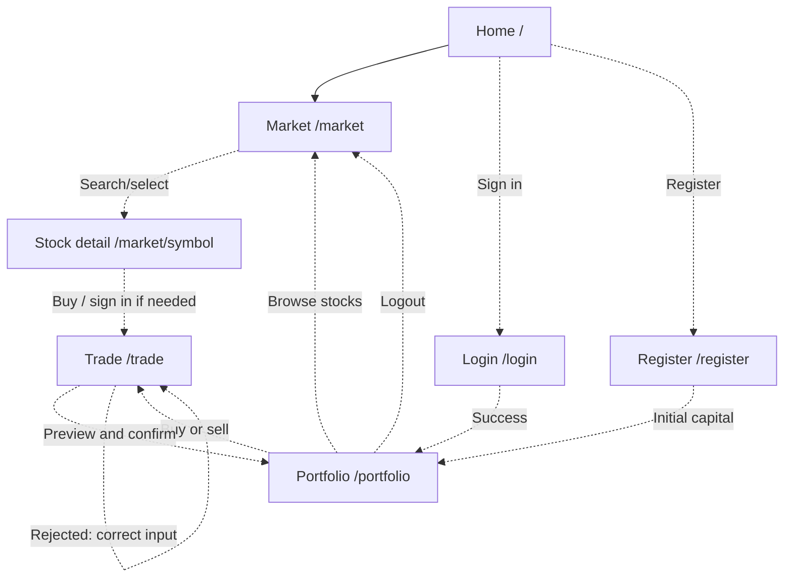

# Milestone 3 — VirtuTrade UI

Planning baseline recorded 10 October 2026 against main commit `a7f24e6`.
PO: @bianh13. Sprint 3 SM: @longbk761-bot. This dossier is in progress:
wireframes, implemented journeys and browser evidence are still required.

## 1. P0 stories and status

Statuses describe the observed implementation baseline, not the ambition of an
issue or the existence of a schema. Old M1/M2 issue closure does not prove a
working M3 journey. Feature owners update rows with verified PR/commit evidence.

| Story | Screen(s) | Route | Status | Issue |
|-------|-----------|-------|--------|-------|
| US01 — Register / sign in | Landing page → Register / Sign in | `/register`, `/login` | not started | [#77](https://github.com/SE-FDA-NEU-AI66B/AI66B-Group-5-A4-Investment-and-Portfolio-Management-Simulation/issues/77) |
| US02 — Initial virtual capital | Register → portfolio balance | `/register` → `/portfolio` | not started | [#78](https://github.com/SE-FDA-NEU-AI66B/AI66B-Group-5-A4-Investment-and-Portfolio-Management-Simulation/issues/78) |
| US03 — Find a stock and inspect its quote | Market → search → stock detail | `/market`, `/market/<symbol>` | partly works | [#85](https://github.com/SE-FDA-NEU-AI66B/AI66B-Group-5-A4-Investment-and-Portfolio-Management-Simulation/issues/85) |
| US04 — Buy shares | Market detail → Buy | `/trade?side=buy&symbol=HPG` | partly works | [#76](https://github.com/SE-FDA-NEU-AI66B/AI66B-Group-5-A4-Investment-and-Portfolio-Management-Simulation/issues/76) |
| US05 — Sell shares | Portfolio holding → Sell | `/trade?side=sell&symbol=HPG` | not started | [#79](https://github.com/SE-FDA-NEU-AI66B/AI66B-Group-5-A4-Investment-and-Portfolio-Management-Simulation/issues/79) |
| US06 — View portfolio | Navigation → Portfolio | `/portfolio` | not started | [#81](https://github.com/SE-FDA-NEU-AI66B/AI66B-Group-5-A4-Investment-and-Portfolio-Management-Simulation/issues/81) |
| US10 — Insufficient-balance warning | Buy form → change quantity → preview | `/trade?side=buy` | partly works | [#76](https://github.com/SE-FDA-NEU-AI66B/AI66B-Group-5-A4-Investment-and-Portfolio-Management-Simulation/issues/76) |

US03 renders stored seed/DNSE/simulation snapshots; search/detail remain pending.
US04/US10 have a buy form, preview and atomic purchase implementation, but actual
authentication and portfolio integration remain pending, so neither is works.
See [the implementation handoff](order-implementation.md) for verified tests and dependencies.

Updated screen flow (M1 target refined for M3; only home → market exists today):

## 2. Wireframes

Owner: [#86](https://github.com/SE-FDA-NEU-AI66B/AI66B-Group-5-A4-Investment-and-Portfolio-Management-Simulation/issues/86). Store actual wireframe images in
`docs/images/ui/` and embed them here. The inventory below is a handoff, not a
substitute for wireframes. No running-app screenshot or wireframe is claimed yet.

| P0 screen | The user comes here to ... | Planned API calls | Wireframe |
|-----------|----------------------------|-------------------|-----------|
| Register | create a private simulation account and receive starting capital | POST `/api/accounts` | Pending |
| Login | access their own account | POST `/api/sessions` | Pending |
| Market list | find a stock by ticker/name | GET `/api/market/quotes` | Pending |
| Stock detail | understand price, daily movement and freshness | GET `/api/market/quotes/{symbol}` | Pending |
| Buy/sell | preview and confirm a virtual order | POST `/api/orders/preview`, POST `/api/orders/buy` or `/api/orders/sell` | Pending |
| Portfolio | inspect cash, holdings and performance | GET `/api/portfolio` | Pending |

Shared logout: DELETE `/api/sessions/current`. The login/register page supplies
the pre-auth CSRF token specified in the M2 contract; private mutations must use
the authenticated token. APIs in this inventory remain unimplemented.

Draw the market list in **all four states**: empty (no quotes/search results,
clear action), loading (visible feedback), error (read retry and support path),
data (price, readable timezone, source and freshness). Keep search input when
retrying. An uncertain order POST must not use the read-only retry behavior.

## 3. Error messages

The following are proposed **exact UI messages** for implementation, not observed
runtime output. Codes come from the M2 API contract; the UI may add recovery advice
while retaining the API code. Replace proposals with verified text/evidence before
submission. Example amounts below correspond to the acceptance fixtures.

| API error code | Business rule | Exact message the user sees |
|----------------|---------------|-----------------------------|
| 409 `INSUFFICIENT_CASH` | BR1 — cannot spend more than available cash | Insufficient cash: this order needs 360,000,000 VND but only 72,000,000 VND is available. Reduce the quantity and preview again. |
| 409 `INSUFFICIENT_SHARES` | BR2 — cannot sell more than held | You hold 500 HPG; the maximum you can sell is 500. Reduce the quantity and preview again. |
| 422 `INVALID_QUANTITY` | US04/US05 input validation | Quantity must be a whole number of at least 1 share. Enter a valid quantity and preview again. |
| 409 `EMAIL_IN_USE` | US01 unique email | Email already in use. Sign in with this email or use another email to register. |
| 409 `QUOTE_CHANGED` | BR3 — confirm the accepted quote | Price changed; refresh the preview. Check the new price before confirming your order. |
| 429 `LOGIN_LOCKED` | US01 lockout after five failures | Too many failed sign-in attempts. Your account is temporarily locked. Try again after the countdown ends. |

Show the remaining lockout time from the server beside that last message. Errors
must appear beside the relevant input or in an accessible alert, preserve safe
input, and never show stack traces, credentials or session tokens.

## 4. What changed since M2

**Navigation and presentation architecture:** M2 redirects `/` to a standalone
market page. Walking through registration → market → trade → portfolio exposed
the lack of visible entry points for all other P0 stories. The M3 design now adds
register/login and stock-detail page routes plus a shared navigation template;
feature modules keep their own routes/services/repositories and render within
that shared shell. These are designed routes, not implemented endpoints.

The same PR updates `docs/design.md` section 1 with this boundary and route plan.
Authentication/market owners implement it in their issues, and Vu provides the
wireframes. The shared shell must not contain SQL, trading rules or provider keys.

**Open integration decision:** [#75](https://github.com/SE-FDA-NEU-AI66B/AI66B-Group-5-A4-Investment-and-Portfolio-Management-Simulation/issues/75) must settle the explicit
simulation-quote refresh flow because fixed old seed prices correctly fail the
trade freshness check. Keep demo/live labels and provider timestamps honest;
update this section, design.md and api-contract.md together when that design is
agreed. A successful M3 demo must not depend on a live DNSE session.

Implementation update for #76: Market now links to `/trade`. The buy form shows
loading, validation/shortfall, preview and success/unknown-result states; changing
quantity invalidates the old preview. `QUOTE_MODE=simulation` with a new database
supports explicit `init-demo` and generation through the authenticated refresh
endpoint after #77 installs auth. Schema source `simulation` and a separate ledger
entry preserve provenance. [Design](design.md) and [API handoff](order-implementation.md)
describe the same change. Actual login, portfolio transition and screenshots for
final P0 acceptance are still pending; no fake test session counts as that evidence.
